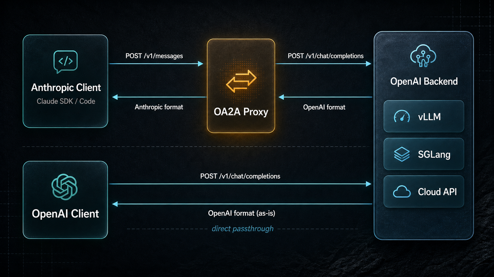

# local-openai2anthropic

[](https://www.python.org/downloads/)
[](https://opensource.org/licenses/Apache-2.0)
[](https://pypi.org/project/local-openai2anthropic/)

**English | [中文](README_zh.md)**

A lightweight proxy that bridges Anthropic and OpenAI ecosystems — run Claude SDK apps on any OpenAI-compatible backend, or use OpenAI clients directly with zero conversion overhead.

---

### Why OA2A

- **双向协议转换** — Anthropic Messages API ↔ OpenAI Chat Completions API，让 Claude SDK / Claude Code 无缝对接 vLLM、SGLang 等任意 OpenAI 后端
- **OpenAI 原生透传** — 同时提供 `POST /v1/chat/completions` 端点，请求原样转发，零转换损耗，保留所有上游字段
- **服务端 Web Search** — 内置 Tavily / 通晓 搜索引擎，任何模型都能获得联网能力，无需客户端改造
- **交错思考 (Interleaved Thinking)** — 完整支持 `thinking` 推理块，配合 `chat_template_kwargs` 和 `reasoning_effort`，DeepSeek V4 等推理模型开箱即用
- **流式 & 工具调用 & 视觉** — SSE 实时流式、Claude tool_use 转换、多模态图像输入，覆盖核心 API 能力
- **模型名映射** — 通配符规则将 Anthropic 模型名自动映射到后端模型，告别手动改配置
- **守护进程 + Web 面板** — `oa2a start/stop/logs` 一键管理，内置 Web 仪表盘监控请求统计

---

## What This Does

Two modes of operation:

| Mode | Endpoint | Use Case |
|------|----------|----------|
| **Anthropic Proxy** | `POST /v1/messages` | Claude SDK / Claude Code apps talking to any OpenAI backend |
| **OpenAI Passthrough** | `POST /v1/chat/completions` | OpenAI-native clients bypassing conversion entirely |



---

## Quick Start

### pip Install

```bash
pip install local-openai2anthropic
```

First run launches an interactive setup wizard:

```bash
oa2a start
```

Or run in foreground:

```bash
oa2a
```

### Docker

```bash
docker run -d --name oa2a -p 8080:8080 \
  -e OA2A_OPENAI_API_KEY=your-key \
  -e OA2A_OPENAI_BASE_URL=http://host.docker.internal:8000/v1 \
  dongfangzan/local-openai2anthropic:latest
```

### Usage Example

```python
import anthropic

client = anthropic.Anthropic(base_url="http://localhost:8080", api_key="any")

message = client.messages.create(
    model="your-model",
    max_tokens=1024,
    messages=[{"role": "user", "content": "Hello!"}],
)
print(message.content[0].text)
```

---

## Daemon Management

```bash
oa2a start              # Start in background
oa2a stop               # Stop background server
oa2a restart            # Restart background server
oa2a status             # Check if running
oa2a logs               # Show recent logs
oa2a logs -f            # Follow logs in real-time
```

---

## Configuration

Config file: `~/.oa2a/config.toml` (auto-created)

### Core Settings

| Option | Required | Default | Description |
|--------|----------|---------|-------------|
| `openai_api_key` | Yes | — | API key for the upstream backend |
| `openai_base_url` | Yes | `https://api.openai.com/v1` | Upstream backend URL |
| `openai_org_id` | No | — | OpenAI Organization ID |
| `openai_project_id` | No | — | OpenAI Project ID |
| `host` | No | `0.0.0.0` | Server bind address |
| `port` | No | `8080` | Server port |
| `api_key` | No | — | Auth key for this proxy (Bearer token) |
| `request_timeout` | No | `300.0` | Upstream request timeout in seconds |
| `log_level` | No | `INFO` | `DEBUG`, `INFO`, `WARNING`, `ERROR` |

### Model Name Mapping

Map Anthropic model names to backend model names with wildcard support:

```toml
default_model = "kimi-k2.5"

[[model_mapping]]
from = "sonnet"
to = "kimi-k2.5"

[[model_mapping]]
from = "*opus*"
to = "deepseek-v4"
```

`from` supports `*` and `?` wildcards. `default_model` is the fallback when no rule matches.

### Web Search

Supports two search providers: [Tavily](https://tavily.com) and [TongXiao (通晓)](https://www.aliyun.com/product/tongxiao).

```toml
tavily_api_key = "tvly-xxx"
tongxiao_api_key = "xxx"
websearch_provider = "tavily"       # "tavily", "tongxiao", or "both"
websearch_max_uses = 5
tavily_max_results = 5
tongxiao_max_results = 5
```

### CORS

```toml
cors_origins = ["*"]
cors_credentials = true
cors_methods = ["*"]
cors_headers = ["*"]
```

---

## API Endpoints

### Anthropic-Compatible

| Method | Path | Description |
|--------|------|-------------|
| `POST` | `/v1/messages` | Create a message (streaming via `stream: true`) |
| `GET` | `/v1/models` | List available models (proxied) |
| `POST` | `/v1/messages/count_tokens` | Count tokens (local tiktoken estimation) |
| `GET` | `/health` | Health check |

### OpenAI-Native Passthrough

| Method | Path | Description |
|--------|------|-------------|
| `POST` | `/v1/chat/completions` | OpenAI-format chat completions (streaming & non-streaming) |

The passthrough endpoint forwards requests directly to the upstream — no validation, no conversion, no model mapping. All fields (including `chat_template_kwargs`, `reasoning_effort`, etc.) are preserved as-is.

---

## Features

- **Streaming** — SSE real-time token streaming in both Anthropic and OpenAI modes
- **Tool Calling** — Claude-compatible tool use (`tool_use` / `tool_result`) converted to OpenAI function calls
- **Vision** — Multi-modal image input via `image_url` content blocks
- **Thinking / Reasoning** — Supports `thinking` blocks with `chat_template_kwargs` (vLLM/SGLang) and `output_config.effort` to `reasoning_effort` mapping for DeepSeek V4
- **Web Search** — Server-side web search via Tavily or TongXiao (通晓), usable with any model
- **Model Mapping** — Wildcard-based model name resolution
- **API Auth** — Optional Bearer token authentication for the proxy itself
- **Web Dashboard** — Built-in web UI at `/` for monitoring request statistics
- **Daemon Mode** — Background service management (start/stop/restart/status/logs)

---

## Using with Claude Code

### Docker (Recommended)

The repo includes a `docker-compose.yml` with both OA2A proxy and Claude Code pre-configured:

```bash
cat > .env << 'EOF'
OA2A_OPENAI_API_KEY=your-api-key
OA2A_OPENAI_BASE_URL=http://host.docker.internal:8000/v1
CLAUDE_MODEL=your-model-name
EOF

docker-compose up -d
docker-compose exec claude-code claude --dangerously-skip-permissions
```

### Local Installation

Configure `~/.claude/settings.json`:

```json
{
  "env": {
    "ANTHROPIC_BASE_URL": "http://localhost:8080",
    "ANTHROPIC_API_KEY": "any",
    "ANTHROPIC_MODEL": "your-model",
    "ANTHROPIC_DEFAULT_SONNET_MODEL": "your-model",
    "ANTHROPIC_DEFAULT_OPUS_MODEL": "your-model",
    "ANTHROPIC_DEFAULT_HAIKU_MODEL": "your-model"
  }
}
```

Then start the proxy (`oa2a start`) and launch Claude Code (`claude`).

---

## Supported Backends

| Backend | Status |
|---------|--------|
| [vLLM](https://github.com/vllm-project/vllm) | Fully supported |
| [SGLang](https://github.com/sgl-project/sglang) | Fully supported |
| Any OpenAI-compatible API | Should work |

> Ollama natively supports the Anthropic API format — point Claude SDK directly to `http://localhost:11434/v1`, no proxy needed.

---

## Development

```bash
git clone https://github.com/dongfangzan/local-openai2anthropic.git
cd local-openai2anthropic
pip install -e ".[dev]"

pytest                           # 445+ tests, >80% coverage
```

---

## License

Apache License 2.0
