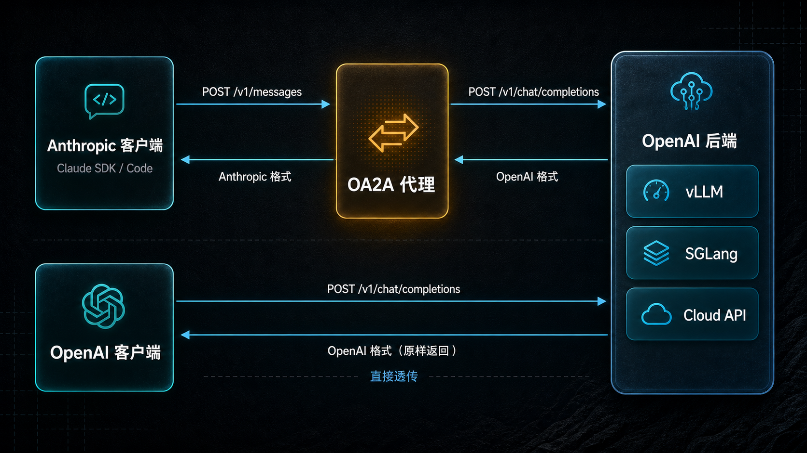

# local-openai2anthropic

[](https://www.python.org/downloads/)
[](https://opensource.org/licenses/Apache-2.0)
[](https://pypi.org/project/local-openai2anthropic/)

**[English](README.md) | 中文**

一个轻量级代理，连接 Anthropic 与 OpenAI 两大生态 —— 让 Claude SDK 应用运行在任意 OpenAI 后端上，也支持 OpenAI 客户端零转换直接透传。

---

### 为什么选择 OA2A

- **双向协议转换** — Anthropic Messages API ↔ OpenAI Chat Completions API，让 Claude SDK / Claude Code 无缝对接 vLLM、SGLang 等任意 OpenAI 后端
- **OpenAI 原生透传** — 同时提供 `POST /v1/chat/completions` 端点，请求原样转发，零转换损耗，保留所有上游字段
- **服务端 Web Search** — 内置 Tavily / 通晓 搜索引擎，任何模型都能获得联网能力，无需客户端改造
- **交错思考 (Interleaved Thinking)** — 完整支持 `thinking` 推理块，配合 `chat_template_kwargs` 和 `reasoning_effort`，DeepSeek V4 等推理模型开箱即用
- **流式 & 工具调用 & 视觉** — SSE 实时流式、Claude tool_use 转换、多模态图像输入，覆盖核心 API 能力
- **模型名映射** — 通配符规则将 Anthropic 模型名自动映射到后端模型，告别手动改配置
- **守护进程 + Web 面板** — `oa2a start/stop/logs` 一键管理，内置 Web 仪表盘监控请求统计

---

## 工作原理

两种运行模式：

| 模式 | 端点 | 适用场景 |
|------|----------|----------|
| **Anthropic 代理** | `POST /v1/messages` | Claude SDK / Claude Code 应用对接任意 OpenAI 后端 |
| **OpenAI 透传** | `POST /v1/chat/completions` | OpenAI 原生客户端直接透传，无转换开销 |



---

## 快速开始

### pip 安装

```bash
pip install local-openai2anthropic
```

首次运行会启动交互式配置向导：

```bash
oa2a start
```

或前台运行：

```bash
oa2a
```

### Docker

```bash
docker run -d --name oa2a -p 8080:8080 \
  -e OA2A_OPENAI_API_KEY=your-key \
  -e OA2A_OPENAI_BASE_URL=http://host.docker.internal:8000/v1 \
  dongfangzan/local-openai2anthropic:latest
```

### 使用示例

```python
import anthropic

client = anthropic.Anthropic(base_url="http://localhost:8080", api_key="any")

message = client.messages.create(
    model="your-model",
    max_tokens=1024,
    messages=[{"role": "user", "content": "你好！"}],
)
print(message.content[0].text)
```

---

## 守护进程管理

```bash
oa2a start              # 后台启动
oa2a stop               # 停止后台服务
oa2a restart            # 重启后台服务
oa2a status             # 查看运行状态
oa2a logs               # 查看最近日志
oa2a logs -f            # 实时跟踪日志
```

---

## 配置

配置文件：`~/.oa2a/config.toml`（自动创建）

### 核心配置

| 选项 | 必需 | 默认值 | 说明 |
|--------|----------|---------|-------------|
| `openai_api_key` | 是 | — | 上游后端 API 密钥 |
| `openai_base_url` | 是 | `https://api.openai.com/v1` | 上游后端 URL |
| `openai_org_id` | 否 | — | OpenAI 组织 ID |
| `openai_project_id` | 否 | — | OpenAI 项目 ID |
| `host` | 否 | `0.0.0.0` | 服务器绑定地址 |
| `port` | 否 | `8080` | 服务器端口 |
| `api_key` | 否 | — | 代理认证密钥（Bearer token） |
| `request_timeout` | 否 | `300.0` | 上游请求超时时间（秒） |
| `log_level` | 否 | `INFO` | `DEBUG`、`INFO`、`WARNING`、`ERROR` |

### 模型名称映射

将 Anthropic 模型名称映射到后端模型，支持通配符：

```toml
default_model = "kimi-k2.5"

[[model_mapping]]
from = "sonnet"
to = "kimi-k2.5"

[[model_mapping]]
from = "*opus*"
to = "deepseek-v4"
```

`from` 支持 `*` 和 `?` 通配符。`default_model` 是无匹配规则时的默认值。

### 网络搜索

支持两种搜索提供商：[Tavily](https://tavily.com) 和 [通晓](https://www.aliyun.com/product/tongxiao)。

```toml
tavily_api_key = "tvly-xxx"
tongxiao_api_key = "xxx"
websearch_provider = "tavily"       # "tavily"、"tongxiao" 或 "both"
websearch_max_uses = 5
tavily_max_results = 5
tongxiao_max_results = 5
```

### CORS

```toml
cors_origins = ["*"]
cors_credentials = true
cors_methods = ["*"]
cors_headers = ["*"]
```

---

## API 端点

### Anthropic 兼容

| 方法 | 路径 | 说明 |
|--------|------|-------------|
| `POST` | `/v1/messages` | 创建消息（通过 `stream: true` 支持流式） |
| `GET` | `/v1/models` | 列出可用模型（代理转发） |
| `POST` | `/v1/messages/count_tokens` | Token 计数（本地 tiktoken 估算） |
| `GET` | `/health` | 健康检查 |

### OpenAI 原生透传

| 方法 | 路径 | 说明 |
|--------|------|-------------|
| `POST` | `/v1/chat/completions` | OpenAI 格式对话补全（支持流式和非流式） |

透传端点将请求原样转发到上游 —— 无校验、无转换、无模型名映射。所有字段（包括 `chat_template_kwargs`、`reasoning_effort` 等）均保持原样。

---

## 功能特性

- **流式响应** — Anthropic 和 OpenAI 两种模式均支持 SSE 实时流式输出
- **工具调用** — Claude 兼容的工具调用（`tool_use` / `tool_result`）转换为 OpenAI 函数调用
- **视觉模型** — 通过 `image_url` 内容块支持多模态图像输入
- **思考/推理** — 支持 `thinking` 块，配合 `chat_template_kwargs`（vLLM/SGLang）以及 DeepSeek V4 的 `output_config.effort` 到 `reasoning_effort` 映射
- **网络搜索** — 通过 Tavily 或通晓进行服务端网页搜索，适用于任何模型
- **模型映射** — 基于通配符的模型名称解析
- **API 认证** — 代理本身支持可选的 Bearer token 认证
- **Web 控制台** — 内置 Web 界面 `/`，用于监控请求统计
- **守护进程模式** — 后台服务管理（启动/停止/重启/状态/日志）

---

## 配合 Claude Code 使用

### Docker（推荐）

仓库中已包含预配置好 OA2A 代理和 Claude Code 的 `docker-compose.yml`：

```bash
cat > .env << 'EOF'
OA2A_OPENAI_API_KEY=your-api-key
OA2A_OPENAI_BASE_URL=http://host.docker.internal:8000/v1
CLAUDE_MODEL=your-model-name
EOF

docker-compose up -d
docker-compose exec claude-code claude --dangerously-skip-permissions
```

### 本地安装

配置 `~/.claude/settings.json`：

```json
{
  "env": {
    "ANTHROPIC_BASE_URL": "http://localhost:8080",
    "ANTHROPIC_API_KEY": "any",
    "ANTHROPIC_MODEL": "your-model",
    "ANTHROPIC_DEFAULT_SONNET_MODEL": "your-model",
    "ANTHROPIC_DEFAULT_OPUS_MODEL": "your-model",
    "ANTHROPIC_DEFAULT_HAIKU_MODEL": "your-model"
  }
}
```

然后启动代理（`oa2a start`）并运行 Claude Code（`claude`）。

---

## 支持的后端

| 后端 | 状态 |
|---------|--------|
| [vLLM](https://github.com/vllm-project/vllm) | 完全支持 |
| [SGLang](https://github.com/sgl-project/sglang) | 完全支持 |
| 任意 OpenAI 兼容 API | 应可正常使用 |

> Ollama 原生支持 Anthropic API 格式 —— 直接将 Claude SDK 指向 `http://localhost:11434/v1` 即可，无需代理。

---

## 开发

```bash
git clone https://github.com/dongfangzan/local-openai2anthropic.git
cd local-openai2anthropic
pip install -e ".[dev]"

pytest                           # 445+ 测试, >80% 覆盖率
```

---

## 许可证

Apache License 2.0
